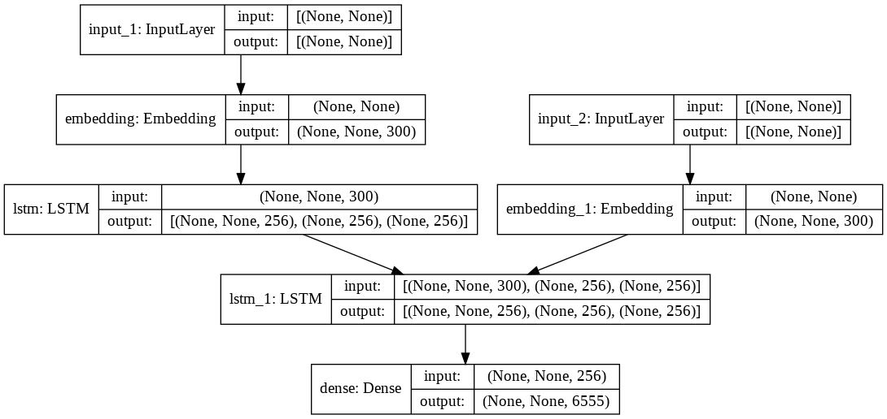

# Eng-Ara-NMT
University Assignment (EECE 693 - Neural Networks @ AUB) where we created a NMT model to translate sentences from English to Arabic

## Dataset
The dataset contains 11668 samples, each sample is made of 4 parts separated by tabs. The first part 
is the English sentence, the second is the Arabic translation, the third and fourth part are not great 
importance to us, but they are the other languages and attribution according to the dataset 
documentation. The sentences length is varying in increasing order, with the longest English sentence 
made of 34 words and the longest Arabic sentence made of 29 words.

## Data Preprocessing
For the English sentences, we will need to first extract the English sentence from each sample, 
then we will need to minimize the words and remove the punctuation (“Hi.” and “hi” should amount to 
the same word).
 
For the English sentences, we will need to first extract the English sentence from each sample, 
then we will need to minimize the words and remove the punctuation (“Hi.” and “hi” should amount to 
the same word).
 
- For the tokenization, I will use the built in keras TextVectorization which will automatically remove 
punctuation and lower case words, as well as helps in creating the vocabulary and dictionary mapping 
indices to words. I will also use “sos” as the start of sequence token and “eos” as the end of sequence 
token. The padding will an empty word “ ” that will be present after the “eos” token until the max length.
 
I decided to use 80% of the data for training, 10% for validation and 10% for testing because the 
model was overfitting, and I wasn’t able to use the whole dataset because of RAM limitations on google 
colab.

## Model
The model is a seq2seq network were the encoder takes as input the English sentences and generates a fixed-length 
fearure vector of the encoded information. The decoder receives the encoded information as input and generates the 
corresponding Arabic translations. I will use LSTM layers for the encoder and decoder. Also I will use pre-trained
word embeddings (GloVe). Glove works by building a matrix of co-occurrence.

## Example Results
### Inference on training set

### Inference on testing set

